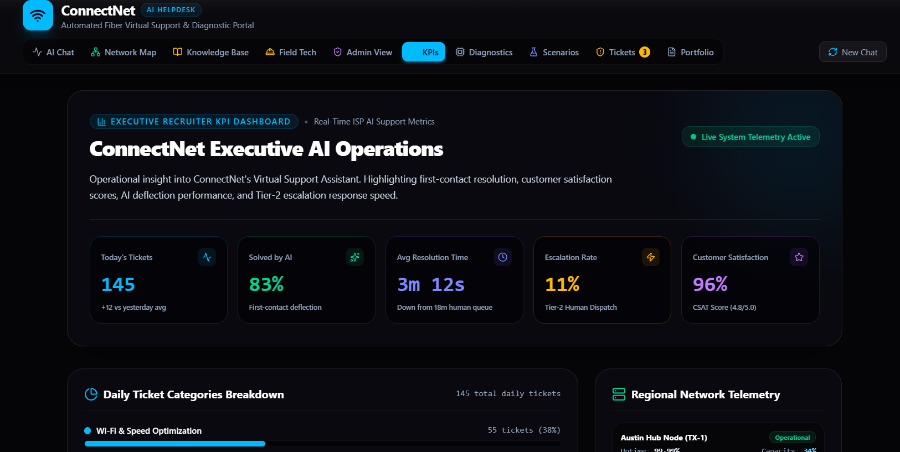
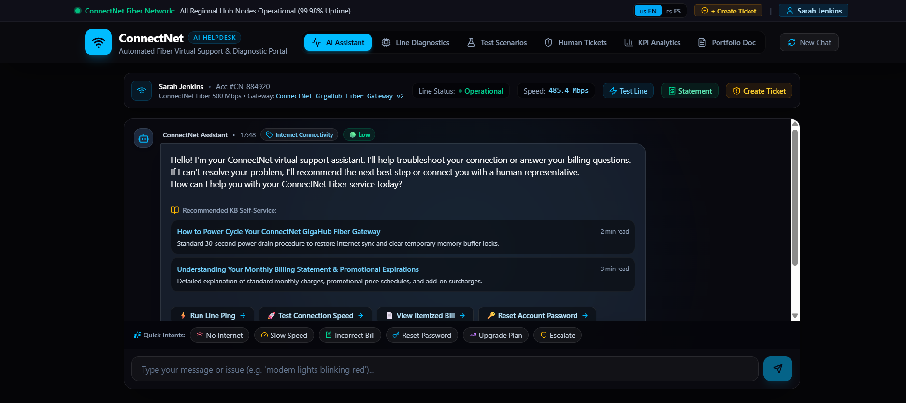
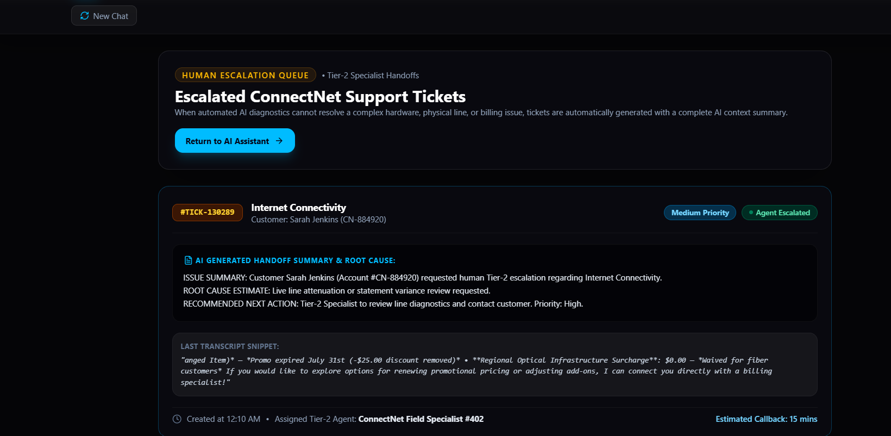
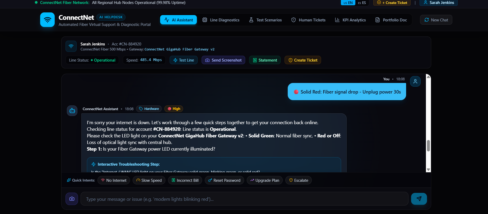
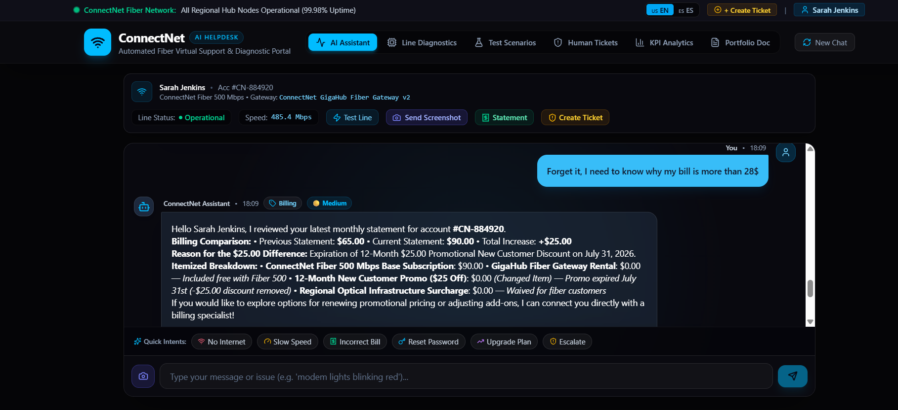
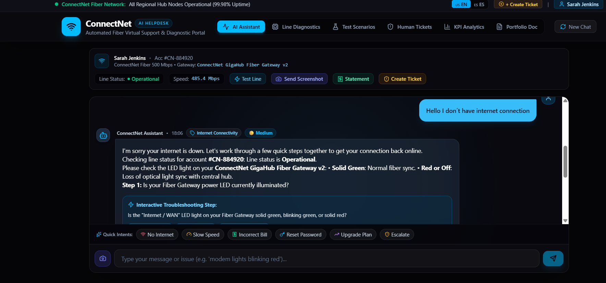

# AI Helpdesk Agent

## Overview

This project demonstrates an AI-powered helpdesk assistant designed to improve customer support by providing fast, accurate, and consistent responses to customer inquiries.

The assistant was developed using Google AI Studio and prompt engineering techniques to simulate real-world customer service scenarios.

---

## Live Demo

Try the AI Helpdesk Agent here:

[Open AI Helpdesk Agent](https://ai.studio/apps/42f39e1c-ac7a-4416-84c9-7cbb0991e2e0)

## Features

- Answers common customer questions
- Assists with troubleshooting
- Provides consistent support responses
- Reduces response time
- Improves customer experience

---

## Technologies Used

- Google AI Studio
- Gemini
- Prompt Engineering
- Artificial Intelligence
- Customer Support Automation

---

## Business Value

This project demonstrates how AI can help organizations improve customer support efficiency while maintaining a high-quality customer experience.

---

## My Role

Designed and developed this AI-powered helpdesk assistant using Google AI Studio and prompt engineering techniques. I focused on creating a practical AI solution that improves customer support workflows, reduces repetitive tasks, and enhances the customer experience.

## How It Works

1. User submits a customer support question.
2. The AI agent analyzes the request using natural language processing.
3. The agent generates a helpful response based on the provided instructions and knowledge.
4. The user receives a consistent and efficient support experience.

---

## Project Goal

The goal of this project is to demonstrate how artificial intelligence can support customer service teams by automating common inquiries, reducing response times, and improving customer satisfaction.

## Skills Demonstrated

- AI Prompt Engineering
- Customer Support
- Technical Documentation
- Workflow Design
- Problem Solving
- AI Implementation

---

## Screenshots

### Project Overview

### AI Helpdesk Agent

### Agent Configuration

### Example Conversation 1

### Example Conversation 2

### Agent Overview

## Status

Project in development.

Future updates will include screenshots, conversation examples, workflow documentation, and additional improvements.
